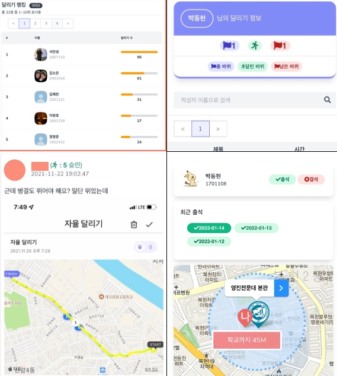

# Checkmate (출석을 위한 프로그레시브웹앱)

> 같은 반 학우들을 위해 만든 프로젝트

평소 학교 출결은 반장이 직접 체크하고 보고하는 방식이었습니다. 그 방식은 번거롭고 실수를 할 가능성이 있었습니다.
그래서 반장의 실수도 줄이면서 학생들이 출석도 하고 교수님이 간편하게 출결을 볼 수 있는 것을 만들면 어떨까?라고 생각했습니다.
프로그래시브웹앱으로 만들었고 실제 출결에 사용했습니다.

# 특징

- 반장 없이도 출석체크가 가능
- 출결을 자동 계산하여 교수님이 확인 가능
- 자신의 출결 현황도 확인 가능

# 주요 기능

## 출석체크

> 교실 근처에서 출석 체크가 가능

## 출결확인

> 자신은 자신의 출결을 확인, 교수님은 전체 학생의 출결 확인 가능

## 통계확인

> 자신의 출결 통계를 차트로 확인

## 랭킹

> 주 / 월 별로 출석 수, 지각 수, 결석 수를 확인 가능

## 기타

> 학교 공지사항, 시간표 확인 가능
